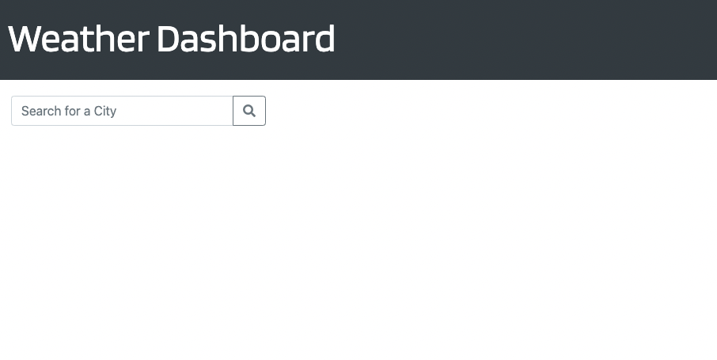
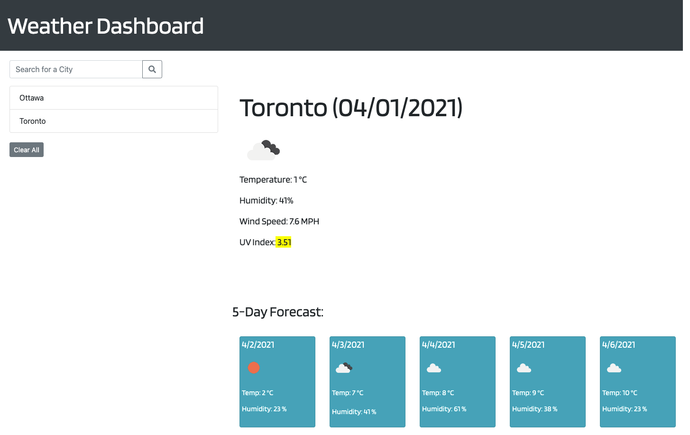
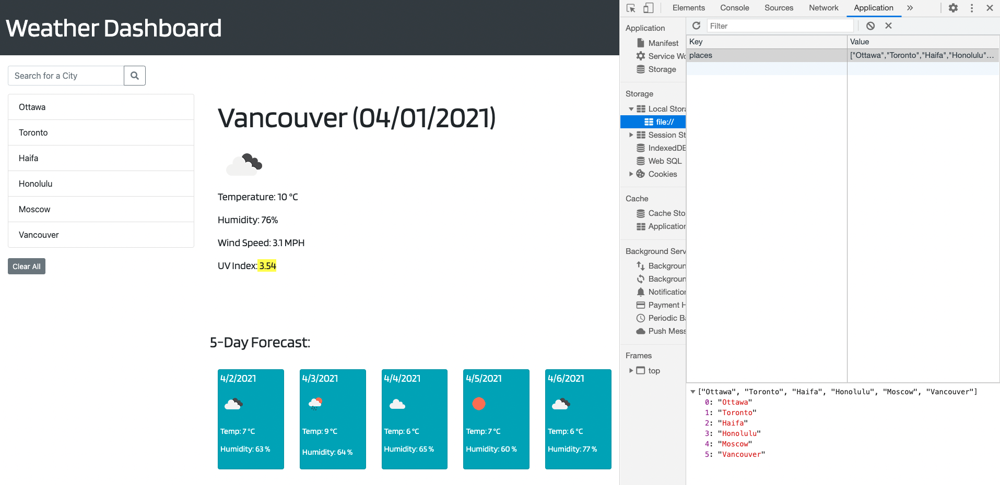
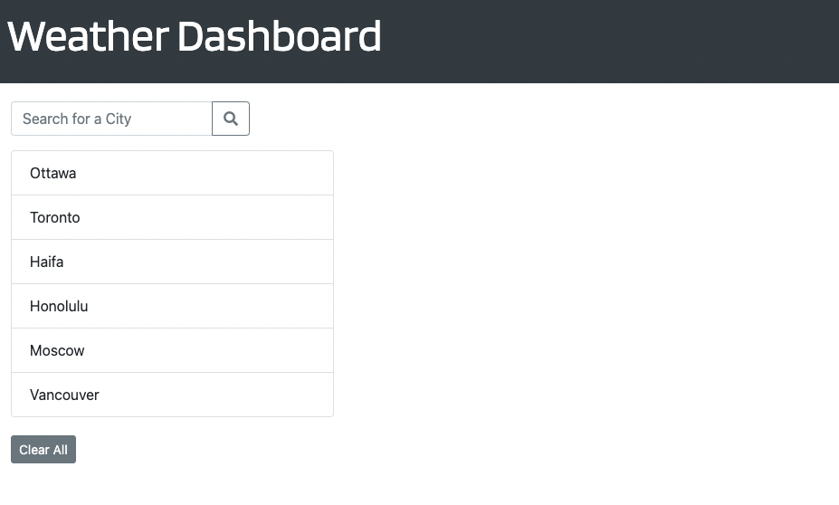
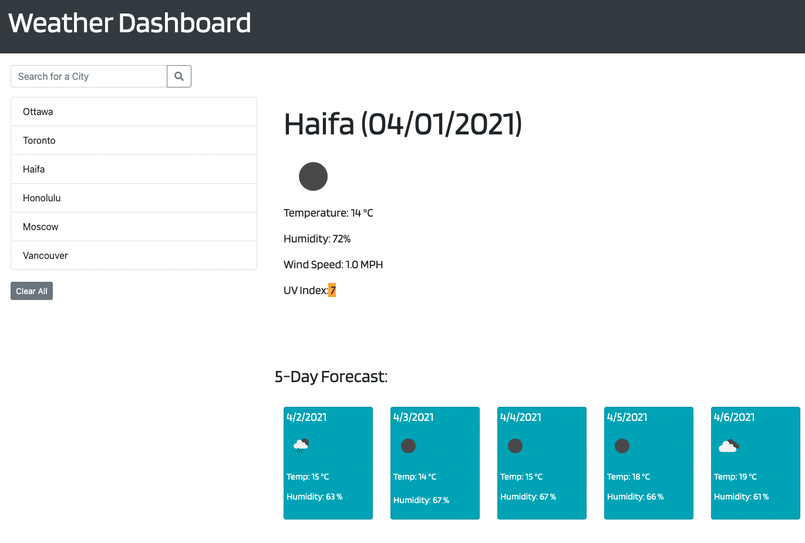
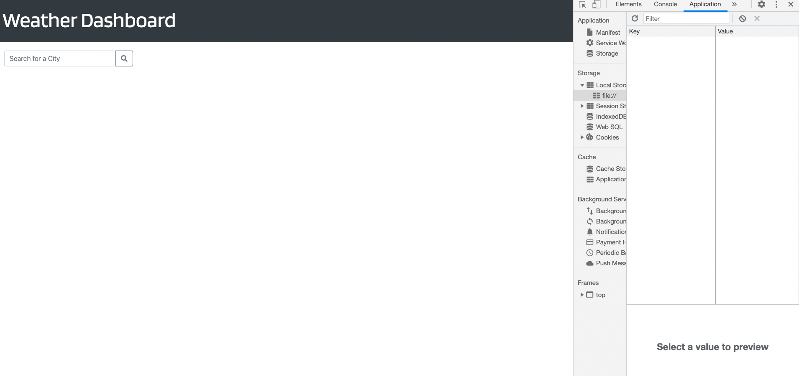

# Weather-Dashboard

## Table of contents

* General info
* Specifics
* Screenhots
* Deployment of application

## General info

 Weather Dashboard allows user to check current weather at any existing city in the world including humidity, wind speed, and colored UV Index. Also, shows 5-day forecast for chosen city.

## Specifics

 When the user types city and clicks search button:

 * the current weather appears on the right side of the screen. It includes:
    * the name of the city that was typed in input section
    * current month/day/year
    * weather icon
    * temperature in °C
    * humidity in %
    * wind speed MPH
    * UV Index, colored based on the conditions (favorable, moderate, severe)

 * city get saved at local storage, and the name of the city appears at the right side of the page

 * 5-day forecast presented after current weather that includes:
     * next day date
     * weather icon
     * temperature in °C
     * humidity in %

 User can search for different cities and they all will be stored at local storage and appears on the left side of the screen. 

 User can click on any of the listed cities to see again the current weather and the 5-day forecast.

 After refreshing the page all previously searched cities will be saved and listed on the right screen of the page. User can click on any of them in order to see the weather.

 If user will click “Clear All” button, all cities will be deleted from the list as well as from the local storage, and the page will be reload.

 If user won’t put any text in input nothing will happened after clicking search button.

## Screenhots

 

 

 

 

 

 

 

## Deployment of application

To run a project, please follow the link [https://sheymanidze.github.io/Weather-Dashboard/](https://sheymanidze.github.io/Weather-Dashboard/)

